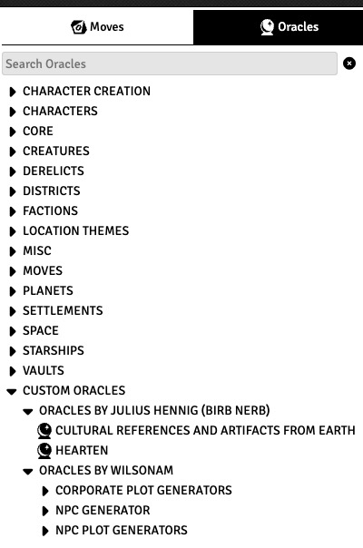

# starforged-custom-oracles


[](https://github.com/jendave/starforged-custom-oracles/releases/latest)

[](LICENSE)

A FoundryVTT compendium of fan-created oracles for the Ironsworn: Starforged system.

# Features and Notes
* Oracle tables contributed by fans are included in the compendium.

# Module Installation
To install the module, search for `Starforged` in the `Add-On Modules` tab of Foundry.

Or use this URL:

```
https://github.com/jendave/starforged-custom-oracles/releases/latest/download/module.json
```

## Use Custom Folders to add Character Sheet Oracles 
* If it does not already exist, create a `Custom Oracles` folder in `Rollable Tables` tab called:
  * `Custom Oracles` - EN
  * `Oráculos personalizados` - ES
  * `Oracles personnalisés` - FR
  * `Własne Wyrocznie` - PL

Open the `Starforged Custom Oracles` compendium and copy the folders into the `Rollable Tables` `Custom Oracles` folder.


The Oracles will be available in the Character sheet under `Custom Oracles`.



# Credits
[Hearten Oracle](https://birb-nerb.itch.io/hearten-oracle) and [Cultural Reference and Artifacts From Earth Oracle](https://birb-nerb.itch.io/cultural-references-and-artifacts-from-earth-oracle-for-ironsworn-starforged) by Julius Hennig are used with permission from the author.

Module by David Hudson and licensed for use under the [MIT license](https://opensource.org/license/mit/).

# Acknowledgements
Many thanks to Ben Straub for his fantastic [Ironsworn & Starforged Game System](https://foundryvtt.com/packages/foundry-ironsworn).

The [foundryvtt-importer module](https://github.com/EthanJWright/foundryvtt-importer) was used to import the tables during the development process.
