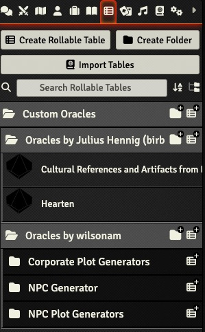

# starforged-custom-oracles


[](https://github.com/jendave/starforged-custom-oracles/releases/latest)

[](LICENSE)

# About
A FoundryVTT compendium of fan-created oracles for the Ironsworn: Starforged system.

# Contact
* [Ironsworn/Starforged Discord Server - FoundryVTT Channel](https://discord.com/channels/437120373436186625/867434336201605160)
* [GitHub Repository](https://github.com/jendave/starforged-custom-oracles)

# Features and Notes
* Oracle tables contributed by fans are included in the compendium.
* Want your Oracle included? Contact us on the [Ironsworn/Starforged Discord](https://discord.com/channels/437120373436186625/867434336201605160)!

# Module Installation
To install the module, search for `Starforged` in the `Add-On Modules` tab of of the Foundry VTT game setup screen. Then click on `Install`.

Or use this URL and click on `Install`:

```
https://github.com/jendave/starforged-custom-oracles/releases/latest/download/module.json
```

## Use Custom Folders to add Character Sheet Oracles 
* If it does not already exist, create a `Custom Oracles` folder in `Rollable Tables` tab called:
  * `Custom Oracles` - EN
  * `Oráculos personalizados` - ES
  * `Oracles personnalisés` - FR
  * `Własne Wyrocznie` - PL
  * `Свои оракулы` - RU

Open the `Starforged Custom Oracles` compendium and copy the folders into the `Rollable Tables` `Custom Oracles` folder.



The Oracles will be available in the Character sheet under `Custom Oracles`.


## Macros
* Drag and drop macros from the `Starforged Custom Oracles Macros` compendium to the macro bar.

## Dependencies
* The [Exploration Oracle Arrays](https://castelviator.itch.io/exploration-oracle-arrays) by Castelviator has the following dependencies.
  * The oracle arrays depend on the oracles in the following FoundryVTT modules in addition to the [Starforged Oracles](https://foundryvtt.com/packages/foundry-ironsworn).
    * [Ironsworn and Ironsworn: Delve](https://foundryvtt.com/packages/foundry-ironsworn)
    * [Ironsmith Expanded Oracles for Ironsworn](https://foundryvtt.com/packages/ironsmith-expanded-oracles)
    * [Starsmith Expanded Oracles for Ironsworn: Starforged](https://foundryvtt.com/packages/starsmith-expanded-oracles)
  * The oracle arrays depend on the following oracles in the [Starforged Custom Oracles](https://foundryvtt.com/packages/starforged-custom-oracles) module.
    * [Better + Moons](https://ellie-valkyrie.itch.io/sfbm) by Ellie_Valkyrie
    * [Exotic Planet Oracles](https://mjatthijs.itch.io/exoticplanetoracles) by Mjatthijs
    * [Settlement Detailing for Starforged](https://wilsonam.itch.io/settlement-detailing-for-starforged) by Alan Wilson

# Credits
Oracles
* [Positive Plot Twists Oracle](https://discord.com/channels/437120373436186625/473169644698468352/1128160532113932349) by dukethesquirrelking is used with permission from the author.
* [Gender Expression Oracle](https://gender-oracle.neocities.org) by kindfulkirby is used with permission from the author.
* [Starforged Gear Oracle](https://illinalta.itch.io/starforged-gear-oracle) by illinalta is used with permission from the author.
* [Better + Moons](https://ellie-valkyrie.itch.io/sfbm) by ellie-valkyrie is used with permission from the author.
* [Iron City](https://vishae.itch.io/ironcity-district-generator) oracles by vishae are licensed for use under the [Creative Commons Attribution-NonCommercial-ShareAlike 4.0 International License (CC BY-NC-SA)](https://creativecommons.org/licenses/by-nc-sa/4.0/).
* [The Starforged Sojourner](https://rossum.itch.io/the-starforged-sojourner) oracle by rossum is used with permission granted to copy for personal use only.
* [Exotic Planets](https://mjatthijs.itch.io/exoticplanetoracles) oracles by mjatthijs used with permission from the author.
* [Exploration Oracle Arrays](https://castelviator.itch.io/exploration-oracle-arrays) by Castelviator used with permission from the author.
* [Star Wars Oracles](https://cdoghusk.itch.io/star-wars-oracles-for-solo-co-op-roleplay) by cdoghusk used with permission from the author.

The following oracles by David Hudson (jendave) are used licensed under the [Creative Commons Attribution 4.0 International License (CC-BY)](https://creativecommons.org/licenses/by/4.0/)
* [Critical Successes](https://jendave.itch.io/critical-success-oracles)
* [I Owe My Soul to the Corporate Planet](https://jendave.itch.io/i-owe-my-soul-to-the-corporate-planet)
* [I'll Be Home for Life Day!](https://jendave.itch.io/ill-be-home-for-life-day)
* [The City on the Breeze](https://jendave.itch.io/the-city-on-the-breeze)

The following oracles by Julius Hennig (birb-nerb) are used with permission from the author.
* [Hearten Oracle](https://birb-nerb.itch.io/hearten-oracle)
* [Cultural Reference and Artifacts From Earth Oracle](https://birb-nerb.itch.io/cultural-references-and-artifacts-from-earth-oracle-for-ironsworn-starforged)
* [Forging Festivities](https://birb-nerb.itch.io/forging-festivities-oracle-starforged) 

The following oracles by wilsonam are used with permission from the author for non-commercial use.
* [NPC and Plots Oracles](https://wilsonam.itch.io/npcs-and-plots-for-starforged) 
* [She Cannae Take It!](https://wilsonam.itch.io/she-cannae-take-it)
* [Settlement Detailing](https://wilsonam.itch.io/settlement-detailing-for-starforged)
* [Settlement Weather](https://wilsonam.itch.io/settlement-weather-oracles-for-starforged)

The following oracles by lm77 are licensed under the [CC BY-NC 4.0 DEED](https://creativecommons.org/licenses/by-nc/4.0/deed.en_) for non-commercial use.
* [MegaCorp Hot Sauce](https://abalone-cushion-e6c.notion.site/MegaCorp-Hot-Sauce-214602dd86d04a5887f6c28ba879660c) 
* [Creature Tags Hot Sauce](https://abalone-cushion-e6c.notion.site/Creature-Tags-Hot-Sauce-eae6966d71524611a17e68a4d425ba9b)
* [Sojourn Hot Sauce](https://abalone-cushion-e6c.notion.site/Soujourn-Hot-Sauce-Oracle-03997a33bea84fa68fa0c61a919fb875)

Module by David Hudson and licensed for use under the [MIT license](https://opensource.org/license/mit/).

Licenses and permissions for the macros are listed in the source code.

# Resources
Many great Ironsworn and Starforged Resources can be found at the links below.
* [Awesome Ironsworn](https://github.com/Billiam/awesome-ironsworn)
* [Starforged 2022 Jam](https://itch.io/jam/starforged-2022-jam)
* [Starforged 2023 Jam](https://itch.io/jam/starforged-2023-jam)
* [Starforged: Ancient Connections Jam](https://itch.io/jam/starforged-ancient-connections/entries)
* [Ironsworn Jam 1](https://itch.io/jam/ironsworn-jam-1/entries)
* [Coalitions of Ironsworn and Starforged Jam](https://itch.io/jam/coalitions-of-ironsworn-and-starforged)

# Acknowledgements
Many thanks to Ben Straub for his fantastic [Ironsworn & Starforged Game System](https://foundryvtt.com/packages/foundry-ironsworn).

Many thanks to graygeist (Discord) for help with finding Oracles to add and getting permission from the authors.

## Modules
The following modules were used in the development process
* [Foundry VTT Content Parser](https://foundryvtt.com/packages/foundry-vtt-content-parser)
* [DF Manual Rolls](https://foundryvtt.com/packages/df-manual-rolls)
